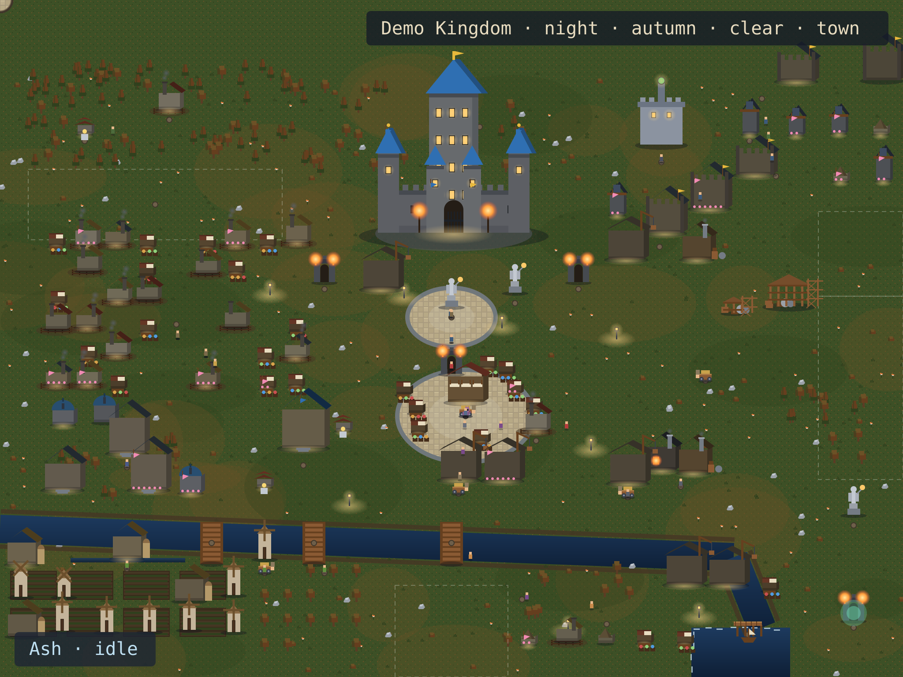
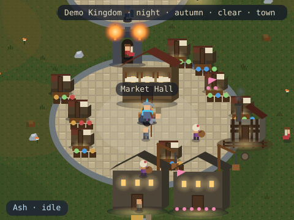
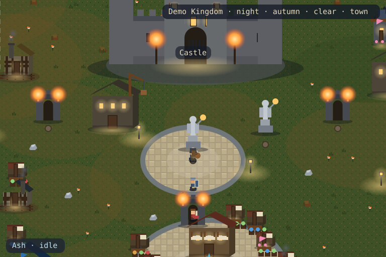

<!-- KINGDOM:START -->
# Demo Kingdom

**Ash** · warden · night autumn · town

<a href="#kingdom">Kingdom</a> · <a href="#story">Story</a> · <a href="#capital">Capital</a> · <a href="#projects">Projects</a> · <a href="#farm">Farm</a> · <a href="#war">War</a> · <a href="#history">History</a> · <a href="#guild">Guild</a>

## Grand Kingdom

<picture>
  <source media="(max-width: 480px)" srcset="grand-mobile.svg"/>
  
</picture>

## Hero Journey

**Ash** is idle — evening at the guild.

## World Districts

### Capital

The castle, royal plaza and hall of heroes.

## History

From a lone outpost to a **town**. The oldest halls have stood 100 days. 

## Guild & Visitors

No travelers at the harbor today. The roads are quiet.

---

<a href="https://github.com/demo-owner">Kingdom status</a> · <a href="https://github.com/demo-owner/demo-owner/issues/new?title=Plant%20a%20flag">Plant a Flag</a> · <a href="https://github.com/demo-owner/demo-owner/issues/new?title=Send%20a%20raid">Send a Raid</a>

Scenario: quiet-night · rendered deterministically by Kingdom V3

<!-- KINGDOM:END -->
