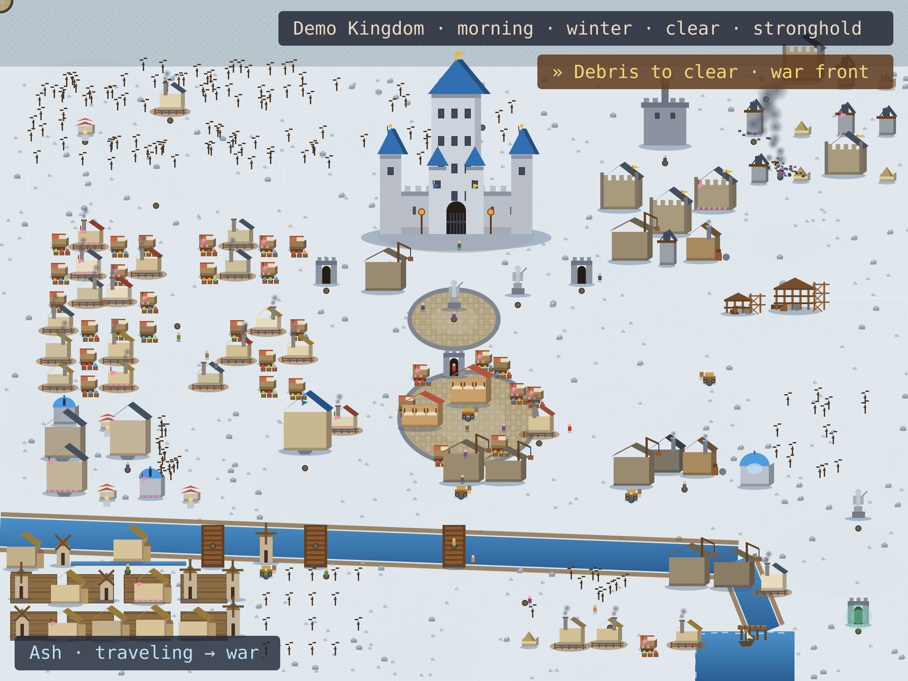
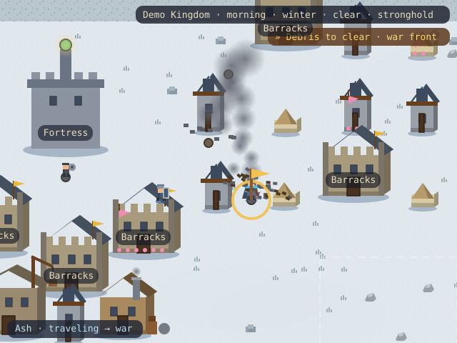
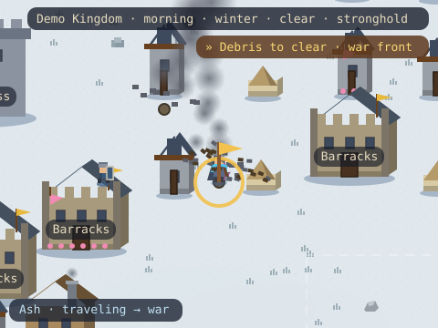
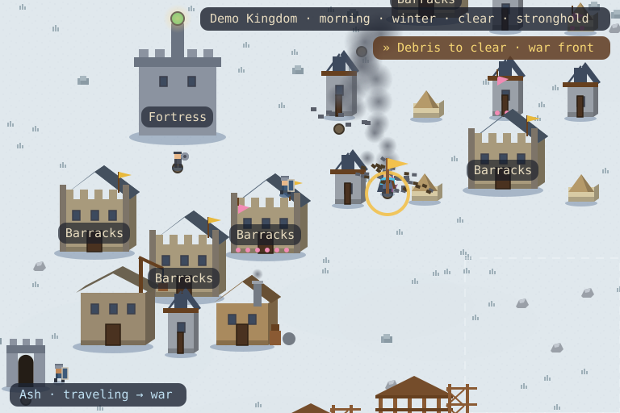

<!-- KINGDOM:START -->
# Demo Kingdom

**Ash** · warden · morning winter · stronghold

<a href="#kingdom">Kingdom</a> · <a href="#story">Story</a> · <a href="#capital">Capital</a> · <a href="#projects">Projects</a> · <a href="#farm">Farm</a> · <a href="#war">War</a> · <a href="#history">History</a> · <a href="#guild">Guild</a>

## Grand Kingdom

<picture>
  <source media="(max-width: 480px)" srcset="grand-mobile.svg"/>
  
</picture>

## Current Story

**Debris to clear** near war front.

## Hero Journey

**Ash** is traveling — responding: war aftermath.

## World Districts

### War

The northern war front.

## History

From a lone outpost to a **stronghold**. The oldest halls have stood 100 days. 

## Guild & Visitors

No travelers at the harbor today. The roads are quiet.

---

<a href="https://github.com/demo-owner">Kingdom status</a> · <a href="https://github.com/demo-owner/demo-owner/issues/new?title=Plant%20a%20flag">Plant a Flag</a> · <a href="https://github.com/demo-owner/demo-owner/issues/new?title=Send%20a%20raid">Send a Raid</a>

Scenario: war-aftermath · rendered deterministically by Kingdom V3

<!-- KINGDOM:END -->
