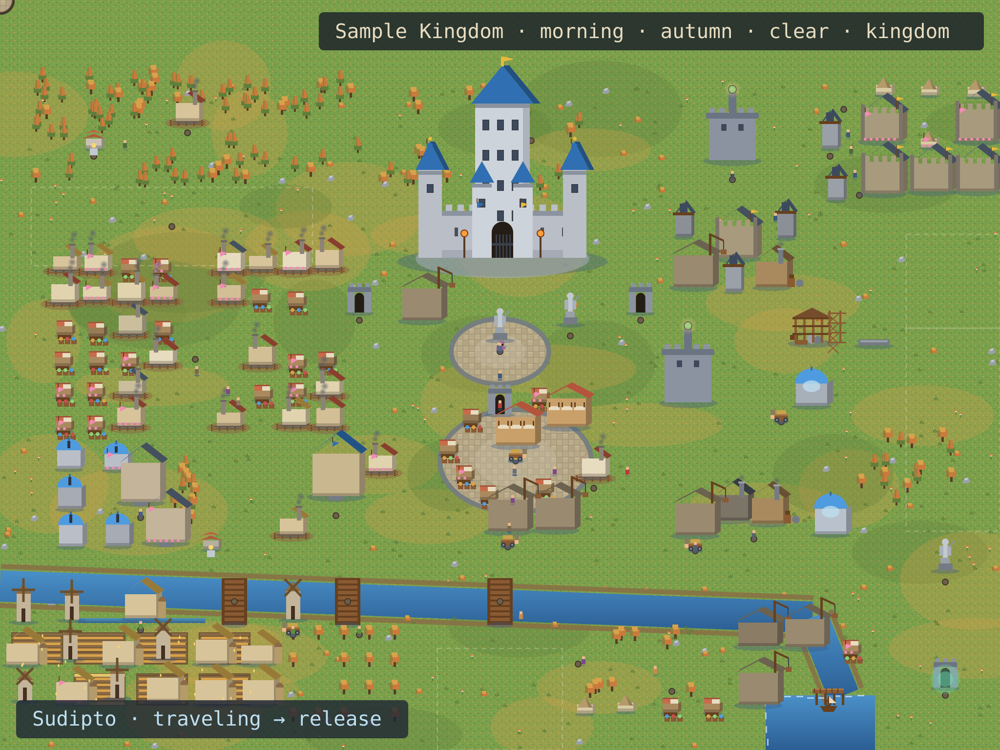
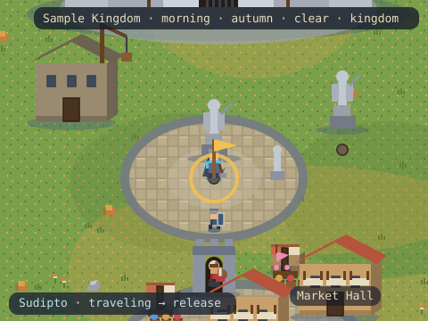
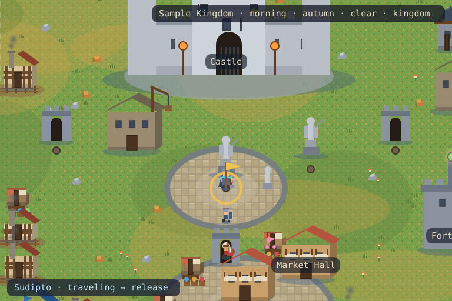
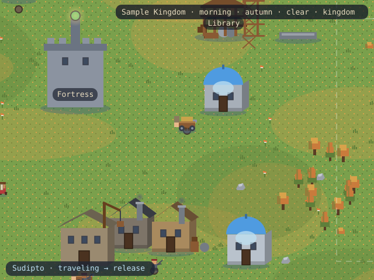
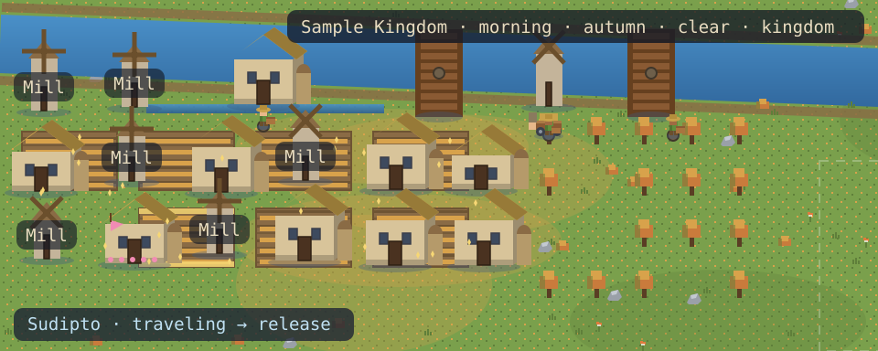

<!--
  EXAMPLE profile README — output of `node engine/cli.mjs render`
  for a sample profile (see docs/sample-profile/ for the pictured assets).
  Generated 2026-10-07; deterministic for the same snapshot.
-->

<!-- KINGDOM:START -->
# Sample Kingdom

**Sudipto** · builder · morning autumn · kingdom

<a href="#kingdom">Kingdom</a> · <a href="#story">Story</a> · <a href="#capital">Capital</a> · <a href="#projects">Projects</a> · <a href="#farm">Farm</a> · <a href="#war">War</a> · <a href="#history">History</a> · <a href="#guild">Guild</a>

## Grand Kingdom

<picture>
  <source media="(max-width: 480px)" srcset="sample-profile/grand-mobile.svg"/>
  
</picture>

## Hero Journey

**Sudipto** is traveling — heading to the royal plaza.

## World Districts

### Capital

The castle, royal plaza and hall of heroes.

### Projects

Repository halls and workshops rising in the east.

### Farm

Contribution fields, orchard and mill.

## History

From a lone outpost to a **kingdom**. The oldest halls have stood 900 days. 1 trophy stands in the Hall of Heroes. 

## Guild & Visitors

Travelers at the harbor:

- **friend1** planted a flag — “hello kingdom”
- **raider1** planted a raid banner — “for glory”

Scenario: live · rendered deterministically by Kingdom V3

<!-- KINGDOM:END -->
