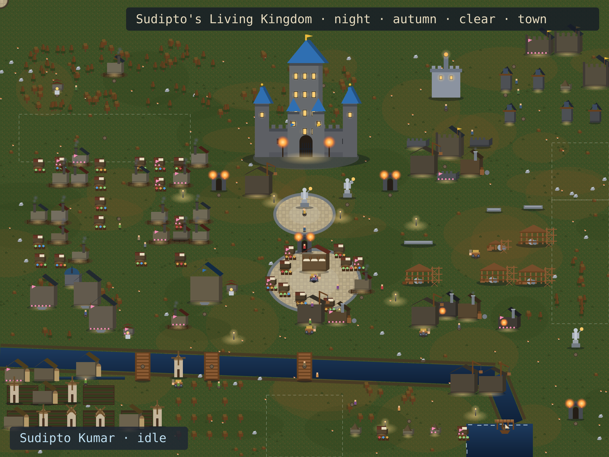
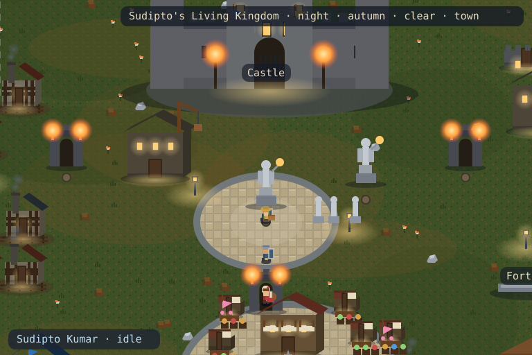
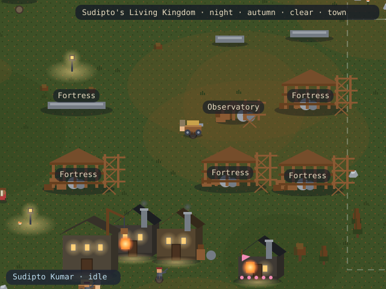
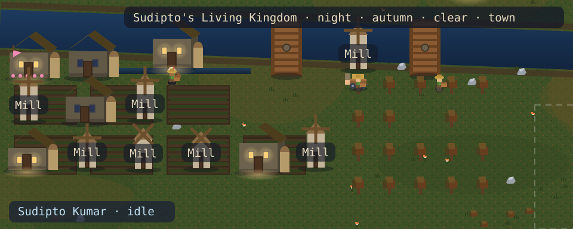

<!-- KINGDOM:START -->
# Kingdom

**Sample Hero** · warden · morning summer · city

<a href="#kingdom">Kingdom</a> · <a href="#story">Story</a> · <a href="#capital">Capital</a> · <a href="#projects">Projects</a> · <a href="#farm">Farm</a> · <a href="#war">War</a> · <a href="#history">History</a> · <a href="#guild">Guild</a>

## Grand Kingdom

<picture>
  <source media="(max-width: 480px)" srcset="grand-mobile.svg"/>
  
</picture>

## Hero Journey

**Sample Hero** is traveling — heading to the royal plaza.

## World Districts

### Capital

The castle, royal plaza and hall of heroes.

### Projects

Repository halls and workshops rising in the east.

### Farm

Contribution fields, orchard and mill.

## History

From a lone outpost to a **city**. The oldest halls have stood 900 days. 7 trophies stand in the Hall of Heroes. 

## Guild & Visitors

Travelers at the harbor:

- **traveler-jo** planted a flag — “greetings from the north road”

Scenario: live · rendered deterministically by Kingdom V3

Offline demo snapshot — set <code>GH_TOKEN</code> and re-run <code>update</code> for live GitHub data.

<!-- KINGDOM:END -->
